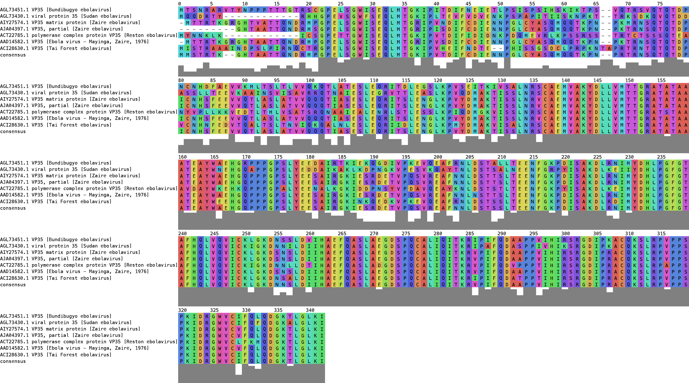

# Microbesoft
This is the result of our participiation in [Copenhacks 2018](http://www.copenhacks.com/), created 7th-8th of April, 2018.
The team members are:
- [Christian](https://github.com/degnbol)
- [Hannah](https://github.com/hmmartiny)
- [Rebeca](https://github.com/rbcbek)
- [Valentijn](https://github.com/ValentijnBroeken)

The purpose of this script is to make it easier to plot large datasets of gene sequences and add functionalities such as the consensus sequence.

### Domain
http://microbesoft.net/

## Prerequisites
Download and install the MAFFT alignment tool from [source](https://mafft.cbrc.jp/alignment/software/source.html).


## The script 
```console
python src/align.py -in input_file -c color_scheme -w char_width
```
The script takes the following arguments:
- `-in --infile`: the input fasta file
- `-out --outfile [optional]`: Outfile name. Default is infile with "align" added.
- `-p --plotfile [optional]`: Plot outfile name. Default is infile with ending .png.
- `-c --colors [optional]`: options are "all", "dna", "gbmr4", "sdm12", "hsdm17", "hp2", "murphy10", 
    "alex6", "aromatic2", "hp_vs_aromatic", "cinema".  Default is "cinema".
- `-w --width [optional]`: width in characters of the sequence. Default is 200.

## Example
Navigate to the correct folder
```
cd ~/Microbesoft
```
Run the script
```console
python src/align.py  -in data/ebola_virus_reduced.fasta -c cinema -w 100
```

